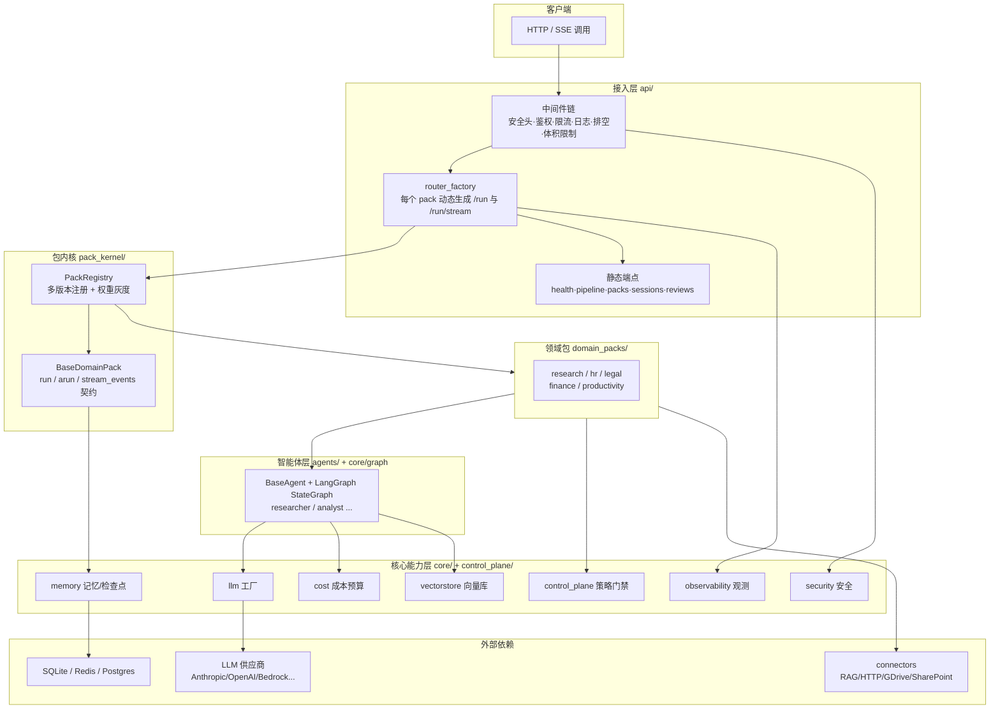
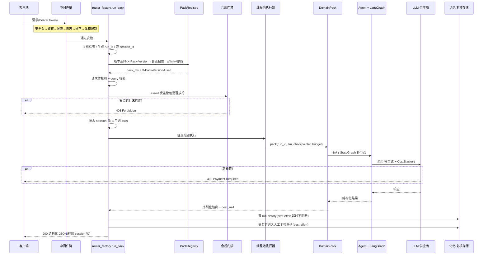
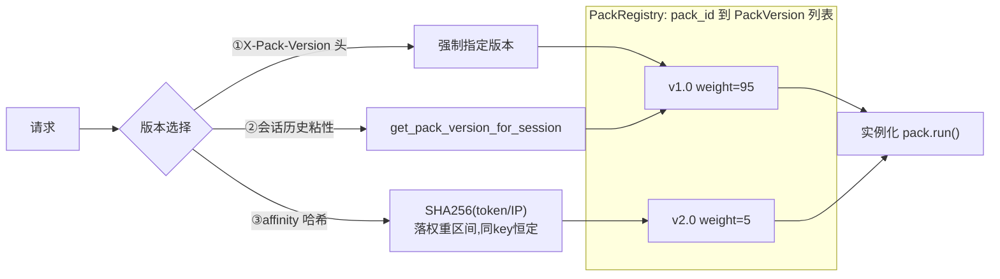
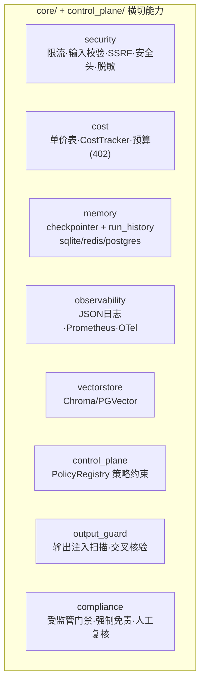
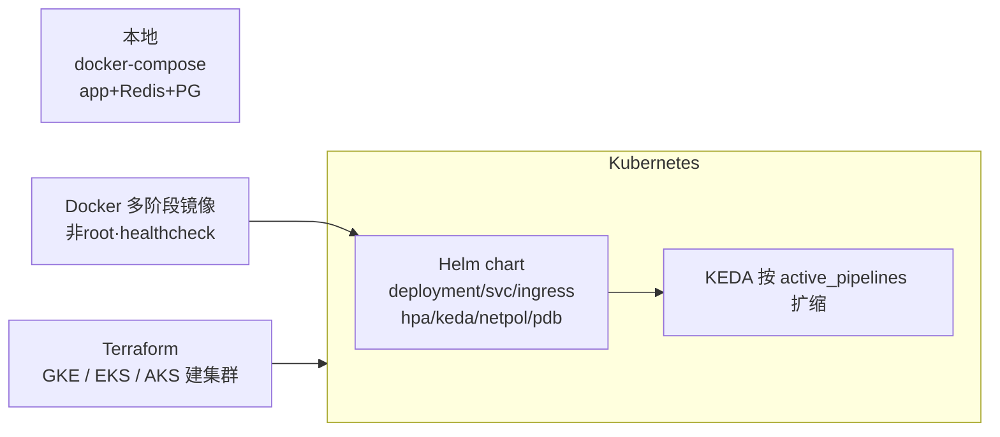

# langgraph-agent-stack 架构分析

> 本文基于对仓库源码(`api/`、`pack_kernel/`、`core/`、`control_plane/`、`domain_packs/`、`connectors/`、`infra/`)的实际阅读整理,图文并茂地说明项目架构。
> 文中所有 mermaid 图在支持的 Markdown 预览器(含 GitHub、Cursor)中可直接渲染。

---

## 目录

1. [整体定位与分层](#一整体定位与分层)
2. [模块职责地图](#二模块职责地图)
3. [请求全生命周期](#三请求全生命周期最关键的一张图)
4. [包内核与灰度](#四包内核与灰度平台的心脏)
5. [核心能力层(横切基建)](#五核心能力层横切基建)
6. [部署形态](#六部署形态)
7. [扩展点与当前边界](#七扩展点与当前边界)
8. [它解决了哪些痛点](#八它解决了哪些痛点设计动机)
9. [一句话总括](#九一句话总括)

---

## 一、整体定位与分层

这是一个 **“生产化 LangGraph 多智能体”的平台内核(platform kernel)**。核心思想:把每个 AI 业务封装成标准化的 **Domain Pack(领域包)**,平台层统一供给鉴权、限流、成本、记忆、可观测、合规等横切能力,pack 只写业务。

---

## 二、模块职责地图

| 层 | 目录 | 职责 |
|---|---|---|
| 接入层 | `api/` | FastAPI 应用、中间件链、动态路由工厂、生命周期装配 |
| 包内核 | `pack_kernel/` | `BaseDomainPack` 契约、`PackRegistry` 多版本注册与灰度、内置包注册、插件加载 |
| 领域包 | `domain_packs/` | 13 个内置业务包(research/hr/legal/finance/productivity)+ `common/` 共享件(合规、输出防护、结构化 LLM) |
| 智能体 | `agents/` | `BaseAgent`(重试/成本/错误封装)、researcher、analyst |
| 核心能力 | `core/` | llm、cost、memory、security、observability、vectorstore、review_store、graph、tools、config |
| 控制面 | `control_plane/` | `PolicyRegistry` 策略(预算上限、查询长度、流超时、人工复核开关)+ 边界强制 |
| 连接器 | `connectors/` | 外部数据源抽象(RAG/HTTP/GDrive/SharePoint)+ OAuth + resolver |
| 评测 | `evals/` | 离线评测(确定性 checks + LLM judge + 数据集) |
| 基础设施 | `infra/` | Dockerfile、docker-compose、Helm chart、Terraform(GKE/EKS/AKS) |

---

## 三、请求全生命周期(最关键的一张图)

以 `POST /packs/{pack_id}/run` 为例,展示一条请求怎么穿过所有层:

设计要点(均在 `api/router_factory.py` 实测):

- **错误到 HTTP 的翻译表**:预算超支 → 402、超时 → 504、LLM 鉴权失败 → 502、执行/校验错 → 500、合规拦截 → 403、session 占用 → 409、关机 → 503。
- **best-effort 持久化**:落库和入复核队列都限时 5s、失败只告警不影响响应——客户端结果已算完,存储慢不该拖累请求。
- **session 单飞**:同一 session 同时只允许一个 run 在跑(`try_acquire_session`),防并发写乱。

---

## 四、包内核与灰度(平台的心脏)

- `BaseDomainPack` 只强制三个方法:`run` / `arun` / `_iter_stream_events`,外加 `input_schema` / `output_schema`。pack 内部 LangGraph 图多复杂平台都不管。
- `PackRegistry` 一个 `pack_id` 可挂多版本 + 权重,支撑金丝雀发布。版本选择三级优先级:请求头强制 → 会话粘性 → affinity 哈希兜底(无状态、多副本一致)。
- 注册是**显式**的(`pack_kernel/builtin_packs.py` 单一来源),无文件扫描/自动发现,可控可审计。

---

## 五、核心能力层(横切基建)

这些就是把 “agent 上线要做的 80% 脏活” 沉淀成的公共层——每个 pack 自动白嫖,无需重复实现。

补充说明:

- **记忆分两层**:checkpointer(LangGraph 状态,断点续跑/HITL 恢复)+ run history(运行审计),都可在 sqlite/redis/postgres 间切换(单后端制)。
- **成本两道闸**:调用前按最坏情况预估拦截,调用后按真实用量累加,超预算抛错映射 HTTP 402。
- **合规四层**:默认锁死(403)+ COMPLIANCE.md 责任清单 + 服务端强制注入免责声明 + 强制人工复核队列。

---

## 六、部署形态

特别之处:**KEDA 按 `active_pipelines` 业务指标扩缩**,而非 CPU——因为 agent 大多在等 LLM,CPU 很闲,用 CPU 判断会失灵。

---

## 七、扩展点与当前边界

**要加新业务**:`domain_packs/<domain>/<pack_id>/pack.py` 实现 `BaseDomainPack` → 在 `pack_kernel/builtin_packs.py` 注册 → 设 `DEFAULT_PACK_ID` → 自动获得 HTTP 路由 + 全套横切能力。

**架构文档明确尚未实现的**(见 `docs/architecture.md` 收尾):

- 动态包加载(任意路径/三方包免改注册文件)
- 完整控制面(集群级“为所有租户激活包”,当前只有只读发现 + 权重调整)
- 包间连接器(一个包消费另一个包输出)
- 热重载(免进程重启改包代码)

---

## 八、它解决了哪些痛点(设计动机)

这个项目的本质是替你解决 “agent demo 跑通之后,到真正上线之间那 80% 跟 AI 无关、却必须做” 的工程问题。下面是它瞄准的十大生产痛点,以及在本架构中的落点。

| # | 痛点(大白话) | 解决方案 | 架构落点 |
|---|---|---|---|
| 1 | agent 只是个脚本,不是服务 | FastAPI + SSE 流式,统一 `/run` 与 `/run/stream` | `api/` 接入层、`router_factory` |
| 2 | 谁都能调、乱调、恶意调 | Bearer 鉴权、滑动窗口限流、输入校验、SSRF 防护、安全响应头 | 中间件链 + `core/security.py` |
| 3 | LLM 按字收费,账单会爆 | 单价表 + `CostTracker` 双道闸(调用前预估拦、调用后累加),超支 HTTP 402 | `core/cost.py`、`BaseDomainPack.budget_usd` |
| 4 | 换供应商要重写代码 | 统一 LLM 工厂,一个环境变量切换 6+ 供应商,含 mock | `core/llm.py` |
| 5 | 多副本记忆对不上 | 可切换存储后端(sqlite/redis/postgres),checkpointer + run history 两层 | `core/memory.py` |
| 6 | 上新版怕把线上搞崩 | 多版本注册 + 权重灰度 + 会话粘性/affinity 哈希,秒级回滚 | `pack_kernel/registry.py`、`router_factory` 版本选择 |
| 7 | 出问题两眼一抹黑 | 结构化 JSON 日志 + Prometheus 指标 + OpenTelemetry 链路,统一 request_id | `core/observability.py` |
| 8 | 代码到 K8s 隔着条河 | Docker/Compose/Helm/Terraform 全套 + KEDA 按业务指标扩缩 | `infra/` |
| 9 | 高危业务乱上线出合规事故 | 合规门禁四层:默认锁死(403)+ 责任清单 + 强制免责注入 + 人工复核队列 | `control_plane/`、`domain_packs/common/compliance.py` |
| 10 | 供应链投毒 / 输出被注入 | 输出完整性扫描 + 可选二次 LLM 交叉核验;CI 安全扫描 + 镜像签名 + SBOM | `domain_packs/common/output_guard.py`、`.github/workflows/security.yml` |

三条贯穿始终的设计哲学:

- **能在业务外拦的绝不进业务**:安全、限流、体积限制、合规门禁都在 pack 执行之前完成。
- **fail-closed 优先**:受监管包默认不可用、CORS 无通配、未知模型 fail-fast——宁可拦错,不可放过。
- **best-effort 不拖累主链路**:落库、入复核队列失败只告警,不影响已算好的响应。

---

## 九、一句话总括

**这是一个 “以 Domain Pack 为业务插槽、以 PackRegistry 为灰度中枢、以 core/ 横切层为地基、以 FastAPI 中间件链为安检、以 K8s/Helm/Terraform 为落地” 的生产级多智能体服务框架。**

它的价值不在 “帮你写 agent 的大脑”,而在 “把大脑装进能上战场的身体”。

---

*本文基于对本仓库源码的实际阅读整理。*
